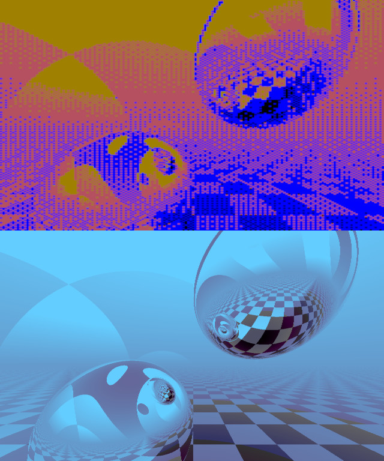

# Raytracer in Rust

Here you can find a port to Rust, of the Ray Tracer in Atari 8-bit BASIC by D. Scott Williamson ( https://bunsen.itch.io/raytrace-movie-atari-8bit-by-d-scott-williamson ).

I provide 2 implementations here: One that follows the Atari code line by line to get close to the the original output, and a fancier implementation in which I have replaced the dithering graphics with the usual color gradient, higher resolution, and multithreading for faster computation. 

The code generates image files. You can then gather them in gif and convert them to a video using ImageMagick and ffmpeg respectively:

Compilation and run:
~~~
cargo build
/target/debug/raytracer
~~~

List of image files to single video:
~~~
convert -delay 10 -loop 0 generated_imgs/img_atari_*.png anim_atari.gif
ffmpeg -i anim_atari.gif -movflags faststart -pix_fmt yuv420p -vf "scale=trunc(iw/2)*2:trunc(ih/2)*2" video_atari.mp4

convert -delay 3 -loop 0 generated_imgs/img_pc_*.png anim_pc.gif
ffmpeg -i anim_pc.gif -movflags faststart -pix_fmt yuv420p -vf "scale=trunc(iw/2)*2:trunc(ih/2)*2" video_pc.mp4
~~~

See also an ASM version created by Nanochess, that fits on a boot sector (https://github.com/nanochess/RayTracer).
